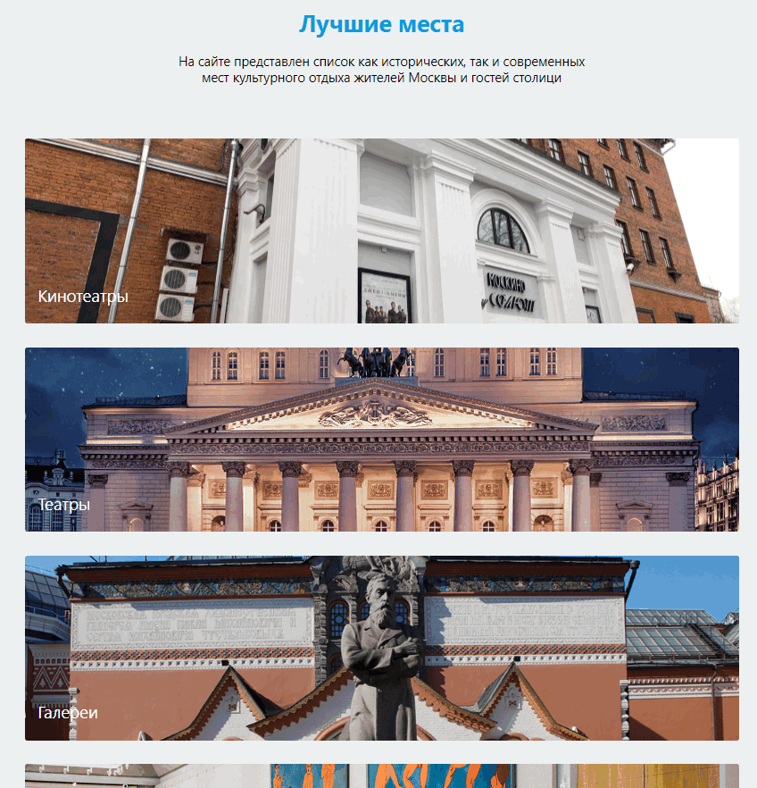

# Moscow-Cinemas
Веб-приложение с информацией о местах культурного отдыха городе Москва. Представляет собой тематический информационный портал

Клиентская часть написана на React.js
Серверная на Node.js, Express.js, MongoDB

# Структура Сайта

Главная страница
Страница категории записей 
Страница записи - страница с информацией о заведении
Страница с избранными заведениями
Страницы Авторизации и регистрации

# Главная страница
На главной странице выводятся Категории записей

# Страница категории записей 
Здесь выводятся списком, присутствует Пагинация - Изначально с сервера браузер получает 16 записей, дополнительное количество записей можно полчить нажав на кнопку "Загрузить еще"

# Страница записи

На странице записи выводится следующее:

Информация о заведении
Галерея изображений
Местопоожение на карте Яндекс
Кометарии - Коментарй может оставить только авторизованный пользователь

# Страница с избранными заведениями

Заведения можно добавлять в избранное. Информация о них будет храниться в local Storage

# Страницы Авторизации и регистрации

Можно создать свою учетную запись на сайте для того, чтобы оставить коментарий на запись. Пароли храняться на сервере в захешированном виде